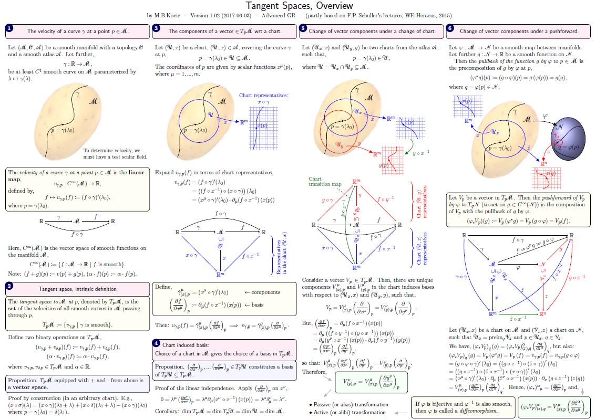

# AGR-tangent-spaces-overview

Tangent spaces and diffeomorphisms (an overview)

Prepared for the SU Fysikum Advanced GR 2016 course. 
(The notation is partly based on F.P. Schuller's lectures, WE-Heraeus, 2015.)

